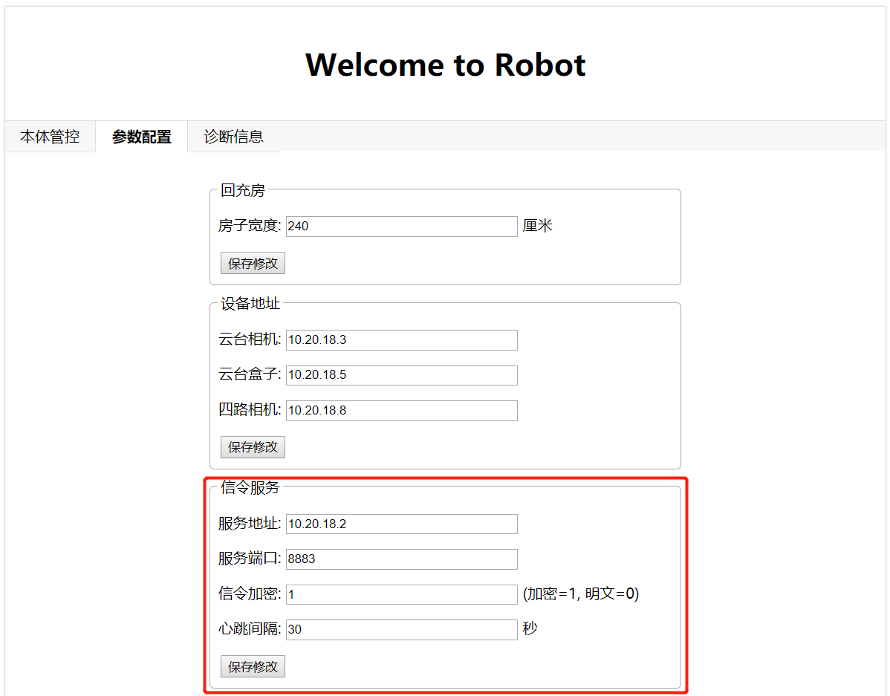

<center>Atris机器人开放接口协议</center>
    mqtt(消息队列遥测传输)是ISO 标准(ISO/IEC PRF 20922)下基于客户端-服务器的消息发布/订阅传输协议。Atris机器人使用mqtt协议与上位机进行通信，为此Atris机器人同时运行了一个mqtt服务器程序以及一个mqtt客服端程序。下文为上位机如何使用mqtt协议与Atris机器人进行通信的说明。

## 上位机与Atris建立mqtt通信 ##

 1. 使用Atris上mqtt服务器
    Atris上部署了mqtt服务器，上位机要使用此服务器与Atris建立mqtt通信，可按如下步骤：
    - 上位机连接Atris的wifi
    - 设置连接mqtt服务器ip为10.20.18.2，端口号为1883
 2. 使用互联网mqtt服务器
    如果使用互联网mqtt服务器，客服端要与Atris建立mqtt通信，需要修改Atris配置参数，然后重启机器人，具体过程如下：
    - 浏览器输入地址：http://10.20.18.2，输入用户名和密码登录到web部署应用，修改信令服务下的服务器地址、服务端口、信令加密等参数配置，如下图所示：
    
    - 保存参数配置并重启机器人
    
      


## Atris上线下线状态 ##

当Atris建立mqtt连接时，表示机器人上线，Atris断开mqtt连接时，表示下线。机器人上线或者下线会发送如下消息：

 - 消息topic:Atris/{robotsn}/status
 - 上线消息内容：online
 - 下线消息内容：offline

## mqtt命令消息topic格式 ##

1. 下行消息topic：
    Atris/{accid}/{robotsn}/{request_title}
    
2. 上行消息Topic：
    Atris/{robotsn}/{accid}/{response_title}
    
    Atris/{robotsn}/{accid}/{notify_title}

|      字段      |                           说明                           |         示例          |
| :------------: | :------------------------------------------------------: | :-------------------: |
|     accid      |                       上位机账号id                       |         admin         |
|    robotsn     |                       机器人的sn号                       |   DAF001UBT90000001   |
| request_title  |   请求命令title字段：前缀为request_，后面是具体命令名    | request_switch_light  |
| response_title |   回复命令title字段：前缀为response_，后面是具体命令名   | response_switch_light |
|  notify_title  | 机器人主动上报title字段：前缀为notify_，后面是具体状态名 |  notify_light_status  |

## mqtt消息内容描述
上位机与Atris通信的消息内容是包含title和content关键字段的json字符串，具体内容大致包括：

 - 请求命令title字段：前缀为request_，后面是具体命令名
 - 回复命令title字段：前缀为response_，后面是具体命令名
 - 主动上报title字段：前缀为notify_，后面是具体状态
 - accid发送者的账号id，如：机器人sn或上位机账号
 - 命令内容包含在content字段

如下是示意的Json协议格式：

 - 请求命令示意：

    ```javascript
    {
        "title":"request_xxx ", 
        "accid": "admin",
        "content": {
    		"id": string,      // 标识命令的UUID，数据类型为string
    		"timestamp": long  // 标识命令发起的时戳，单位毫秒，数据类型为long
     	}
    }
    ```
    
 - 回复命令示意：  

    ```javascript
    {
        "title": "response_xxx ",
        "accid": "DAA001UBT90000001",
        "content": {
    		"id": string,      // 同步命令此id与请求命令id一致
    		"timestamp": long,  // 同步命令与请求命令的时戳保持一致
    	    "result": string // [success, fail_invalid_data，fail_inner_error] 指令处理结果
     	}
    }
    ```
 - 主动上报状态示意：    
     ```javascript
    {
        "title":"notify_xxx ", 
        "accid": "机器人sn",
        "content": {
    		"id": string,      // 标识命令的UUID，数据类型为string
    		"timestamp": long  // 标识命令发起的时戳，单位毫秒，数据类型为long
     	}
    }
    ```

注意：上位机发送给Atris请求命令的content数据类型一定要严格按照协议要求**

## mqtt消息内容具体说明
下文是对上位机与机器控制协议的具体描述：
绑定机器人
-----

 - 上位机请求绑定机器人命令：

    ```javascript
    {
        "title": "request_bound_robot",
        "accid"："abi账号",
        "content": {
            "id": string, 
            "timestamp": long, 
            "channel": string，
            "account": string,     // abi账号
            "pwd": string,        // 密码(对原始密码进行sha1加密)
            "bindmode": int,     // 0：在线；1：离线
            "token": string,
            "phoneNum": string  // 上位机给定的VOIP号码
        }
    }
    ```
**注：绑定机器之前需要在abi鉴权后台添加账号和密码**
    
 - 机器人回复绑定响应：  

    ```javascript
    {
       "title": "response_bound_robot",
        "accid"："abi账号或机器人sn",
        "content": {
            "id": string,
            "timestamp": long,
            "bindmode": int          // 0：在线；1：离线
            "companyid": string,    // 离线绑定时为用户所属的企业号，在线时为空
            "camera_reg_id": string, // 机器人sn号
            "result": string // [success, fail_invalid_pwd, 		 									 fail_other_bound,fail_invalid_data, 									 fail_inner_error, fail_abi_offline,     		                   		  fail_invalid_user]
        }
    }
    ```

解绑机器人
-----

上位机不需要控制机器人之后需要对机器人解除绑定，否则其它账号无法绑定此机器人

 - 上位机请求绑定机器人命令：

    ```javascript
   {
        "title": "request_unbound_robot",
        "accid"："abi账号",
        "content": {
            "id": string, 
            "timestamp": long
            "account": string, //登录ABI用户名
            "pwd": string,  //密码(对密码进行sha1加密)
            "bindmode": int, //0：在线；1：离线
            "token": string 
        }
    }
   ```
 - 机器人回复解绑响应： 

 ```javascript
    {
        "title": "response_unbound_robot",
        "accid"："abi账号或机器人sn",
        "content": {
            "id": string,
            "timestamp": long,
            "result": string // [success，fail_no_bound，												 fail_invalid_pwd,fail_other_bound，										 fail_invalid_data，fail_inner_error,                               	  	  fail_abi_offline]
        }
    }
 ```

重置机器人
-----

如果某账号去绑定机器人时提示fail_other_bound，表示机器人已被其他账号所绑定，此时此账号想去绑定机器人，需重置绑定机器人，将绑定机器人的账号强制解除绑定后，此账号才可以去绑定机器人。

 - 请求重置机器人命令：

    ```javascript
    {
       "title": "request_reset_robot",
        "accid"："abi账号",
        "content": {
            "id": string, 
            "timestamp": long, 
            "token": "",
            "clear": int, // [0, 1, 2] 0: 重置绑定关系；1：重置绑定关系并恢复出厂设置；
                           // 2：重置绑定关系，恢复出厂设置并清除数据
            "account": string, // 登录ABI管理员
            "pwd": string,  // 密码(对密码进行sha1加密),
            "bindmode": int // 0：在线；1：离线
        }
    }
    ```

 - 机器人回复请求重置机器人：

 ```javascript
    {
        "title": "response_reset_robot",
        "accid"："abi账号或机器人sn",
        "content": {
            "id": string,
            "timestamp": long,
            "clear": int, // [0, 1, 2] 0: 重置绑定关系；1：恢复出厂设置；
            "result": string // [success，fail_invalid_user, 											 fail_invalid_pwd,fail_invalid_data，									 fail_inner_error，fail_abi_offline,
            					 fail_abi_invalid_robot]
        }
    }
 ```

 - 机器人上报被重置状态：

    ```javascript
        {
            "title": "notify_other_unbound",
            "accid"："abi账号或机器人sn",
            "content": {
                "id": string,
                "timestamp": long,
                "client": string, // 抢绑上位机账号
                "sn": string // 抢绑机器人序列号
            }
        }
    ```

升级机器人版本
-----
 - 升级机器人版本命令：

```javascript
   {
        "title": "request_sw_upgrade",
        "accid"："abi账号",
        "content": {
            "id": string, 
            "timestamp": long,
            "url": string  // 基于http服务链接升级包下载地址
        }
   }
```
 - 机器人回复升级响应： 

```javascript
    {
       "title": "response_sw_upgrade",
        "accid"："abi账号或机器人sn",
        "content": {
            "id": string,
            "timestamp": long,
            "status": string, // [downloading, imx_upgrading, 				  						  firmware_upgrading, finished]
            "result": string // [success，fail_atris_family, 										 fail_upgrading_now,
                                 fail_downloading,
  								 fail_imx_upgrading,
  								 fail_firmware_upgrading,
       							 fail_do_upgrade_script,                         fail_no_found_tar, fail_untar,	 				 fail_no_found_swu,           		 			 fail_no_found_swu_md5,                          fail_check_md5, fail_unknow, 					fail_no_bound, 	                      		  	fail_invalid_data，fail_inner_error]
        }
    }
```

控制灯开关命令
-----

 - 上位机控制机器人上灯开关命令：

    ```javascript
   {
        "title": "request_switch_light",
        "accid"："abi账号",
        "content": {
            "id": string, 
            "timestamp": long,
            "lamp": int, // 0:照明灯,1:红蓝爆闪灯
            "switch": int // [0: 关, 1: 开]
        }
    }
   ```
   
 - 机器人回复灯开关响应： 

 ```javascript
    {
        "title": "response_switch_light",
        "accid"："abi账号或机器人sn",
        "content": {
            "id": string,
            "timestamp": long, 
            "result": string // [success，fail_no_bound, 						 fail_other_bound,                                                 fail_invalid_data，fail_inner_error]
        }
    }
 ```

获取灯开关状态
-----

 - 上位机获取机器人上灯开关状态命令：

    ```javascript
   {
        "title": "request_get_light_status",
        "accid"："abi账号",
        "content": {
            "id": string, 
            "timestamp": long
        }
    }
   ```
 - 机器人回复灯开关状态响应： 

 ```javascript
    {
        "title": "response_get_light_status",
        "accid"："abi账号或机器人sn",
        "content": {
            "id": string,
            "timestamp": long, 
            "w_light": int, //[0: 关, 1: 开]照明灯
            "rb_light": int, //[0: 关, 1: 开]红蓝爆闪灯
            "result": string // [success，fail_no_bound, 						fail_other_bound,                                        fail_invalid_data，fail_inner_error]
        }
    }
 ```

控制声波驱散开关
-----

 - 上位机控制机器人声波驱散开关命令：

    ```javascript
   {
        "title": "request_sonic_disperse",
        "accid"："abi账号",
        "content": {
            "id": string, 
            "timestamp": long,
            "switch": int //[0: 关, 1: 开]
        }
    }
   ```
 - 机器人回复声音驱散开关响应： 

 ```javascript
    {
        "title": "response_sonic_disperse",
        "accid"："abi账号或机器人sn",
        "content": {
            "id": string,
            "timestamp": long, 
            "result": string // [success，fail_no_bound, 						fail_other_bound,                                         		   fail_invalid_data，fail_inner_error]
        }
    }
 ```

获取声波驱散开关状态
-----

 - 上位机获取机器人声波驱散开关状态命令：

    ```javascript
   {
       "title": "request_get_sonic_disperse_status",
        "accid"："abi账号",
        "content": {
            "id": string, 
            "timestamp": long
        }
    }
   ```
 - 机器人回复灯开关状态响应： 

 ```javascript
    {
        "title": "response_get_sonic_disperse_status",
        "accid"："abi账号或机器人sn",
        "content": {
            "id": string,
            "timestamp": long, ,
            "switch": int, //[0: 关, 1: 开] 
            "result": string // [success，fail_no_bound, 				 	fail_other_bound,                                                  	 fail_invalid_data，fail_inner_error]
        }
    }
 ```

同步宣传文件给机器人
-----
 - 上位机控制机器人同步宣传文件给机器人命令：

    ```javascript
   {
        "title": "request_music_transport",
        "accid"："abi账号",
        "content": {
            "id": string, 
            "timestamp": long,
            "list": [
            	{
                    "name": string, // 同步文件名，如test.mp3
                    "url": string // 基于http服务链接mp3文件下载地址，
                    			 //  如http://xx/test.mp3
                }
            ]
	    }
    }
   ```

 - 机器人回复同步宣传文件响应： 

 ```javascript
    {
        "title": "response_music_transport",
        "accid"："abi账号或机器人sn",
        "content": {
    		"id": string,
            "timestamp": long,
            "url": string, // 基于http服务链接mp3文件下载地址，
            			   // 如http://xx/test.mp3
            "name": string, // 同步文件名，如test.mp3
            "type": "music", // [music]
            "progress": float, // 0~100
            "status": string, // [started, downloading, finished]
            "result": string  // [success, fail_download_error, 				fail_no_bound,                                   		  		fail_out_limits,fail_other_bound, 									 fail_invalid_data]
        }
    }
 ```

 重命名宣传播报文件
-----
 - 上位机控制机器人重命名宣传播报文件命令：

    ```javascript
   {
        "title": "request_music_rename",
        "accid"："abi账号",
        "content": {
            "id": string, 
            "timestamp": long,
            "name": string, 
            "rename": string
	    }
    }
   ```
 - 机器人回复重命名宣传播报文件响应： 

 ```javascript
    {
        "title": "response_music_transport",
        "accid"："abi账号或机器人sn",
        "result": string  // [success, fail_no_bound, 
                              fail_other_bound, fail_invalid_data]
    }
 ```

 删除宣传播报文件
-----
 - 上位机设置机器人删除宣传播报文件命令：

    ```javascript
   {
        "title": "request_music_remove",
        "accid"："abi账号",
        "content": {
            "id": string, 
            "timestamp": long,
            "list": ["test1.mp3", "test2.mp3"] //需要删除的宣传文件列表
        }
    }
   ```
   
 - 机器人回复删除宣传播报文件命令： 

    ```javascript
    {
        "title": "response_music_remove",
        "accid"："abi账号或机器人sn",
        "content": {
            "id": string,
            "timestamp": long, 
            "result": string // [success，fail_no_bound, 						fail_other_bound,                                         		   	fail_invalid_data，fail_inner_error]
        }
    }
    ```

获取宣传播报文件列表
-----
 - 上位机设置机器人获取宣传播报文件列表命令：

    ```javascript
   {
        "title": "request_music_list",
        "accid"："abi账号",
        "content": {
            "id": string, 
            "timestamp": long
        }
    }
   ```
   
 - 机器人回复获取宣传播报文件列表命令： 

    ```javascript
    {
        "title": "response_music_list",
        "accid"："abi账号或机器人sn",
        "content": {
            "id": string,
            "timestamp": long, 
            "list": ["test1.mp3", "test2.mp3", "test3.mp3"],
            "result": string // [success，fail_no_bound,        fail_other_bound,                                         		fail_invalid_data，fail_inner_error]
        }
    }
    ```

播放宣传播报文件

 - 上位机控制机器人播放宣传播报1文件命令：

    ```javascript
   {
        "title": "request_music_play",
        "accid"："abi账号",
        "content": {
            "id": string, 
            "timestamp": long,
            "action":  string, // [play, pause, resume, stop] 
            "mode":  string, // [recycle, recycle_no] 
                  			//  action为pause, resume, stop时mode可以为空
            "play_interval": int  // 播报间隔,单位秒,最大3600s,默认为0s
            "play_list": ["test1.mp3", "test2.mp3"] 
            			// action为pause,resume,stop时play_list可以为空
        }
    }
   ```

 - 机器人回复播放宣传播放文件响应： 

 ```javascript
    {
        "title": "response_music_play",
        "accid"："abi账号或机器人sn",
        "content":{
            "id": string,
            "timestamp": long,
        	"name":  string,
        	"action":  string,
        	"position": long, // milliseconds
            "duration": long,  // milliseconds
            "status": string,  // action为play时status赋值为：
            				  // [started, playing, finished] 
            "result": string // [success, fail_voice_chated, 										fail_play_error, 		    								 		fail_no_play,fail_invalid_data, 									fail_no_bound,fail_other_bound]
        }
    }
 ```

设置宣传播报间隔
-----
 - 上位机设置机器人宣传播报间隔命令：

    ```javascript
   {
        "title": "request_set_play_interval",
        "accid"："abi账号",
        "content": {
            "id": string, 
            "timestamp": long, 
            "play_interval": int // [0~3600秒]
        }
    }
   ```
   
 - 机器人回复设置机器人宣传播报间隔命令： 

    ```javascript
    {
        "title": "response_set_play_interval",
        "accid"："abi账号或机器人sn",
        "content": {
            "id": string,
            "timestamp": long, 
            "list": ["test1.mp3", "test2.mp3", "test3.mp3"],
            "result": string // [success，fail_no_bound,        fail_other_bound,                                         		fail_invalid_data，fail_inner_error]
        }
    }
    ```


获取获取宣传播报间隔
-----
 - 上位机获取机器人宣传播报间隔：

    ```javascript
   {
        "title": "request_get_play_interval",
        "accid"："abi账号",
        "content": {
            "id": string, 
            "timestamp": long
        }
    }
   ```
   
 - 机器人回复获取机器人宣传播报间隔命令： 

    ```javascript
    {
        "title": "response_music_list",
        "accid"："abi账号或机器人sn",
        "content": {
            "id": string,
            "timestamp": long, 
            "play_interval": int // [0~3600秒],
            "result": string // [success，fail_no_bound,        fail_other_bound,                                         		fail_invalid_data，fail_inner_error]
        }
    }
    ```


 控制机器人移动命令
-----
 - 上位机控制机器人移动命令：

    ```javascript
   {
        "title": "request_robot_move",
        "accid"："abi账号",
        "content": {
            "id": string, 
            "timestamp": long,
            "v_linear": float,//浮点数0~1 m/s，正数向前，负数向后
            "v_angular": float //浮点数0~1 m/s	正数向左，负数向右
        }
    }
   ```
 - 机器人回复控制机器人移动命令： 

 ```javascript
    {
        "title": "response_robot_move",
        "accid"："abi账号或机器人sn",
        "content": {
            "id": string,
            "timestamp": long, 
            "result": string //  [on_gs_ctrl, on_rf_ctrl] 
            //正在被导航控制，正在被遥控器控制, PC控制时不回复
        }
    }
 ```

设置机器人行驶速度
-----
 - 上位机设置机器人行驶速度命令：

    ```javascript
   {
        "title": "request_set_speed",
        "accid"："abi账号",
        "content": {
            "id": string, 
            "timestamp": long,
            "speed": float
        }
    }
   ```
 - 机器人回复设置行驶速度命令： 

 ```javascript
    {
        "title": "response_set_speed ",
        "accid"："abi账号或机器人sn",
        "content": {
            "id": string,
            "timestamp": long, 
            "result": string // [success，fail_no_bound, 						fail_other_bound,                                         		   	fail_invalid_data，fail_inner_error]
        }
    }
 ```

读取机器人音频音量
-----
 - 上位机读取机器人音频音量命令：

    ```javascript
   {
        "title": "request_get_volume",
        "accid"："abi账号",
        "content": {
            "id": string, 
            "timestamp": long
        }
    }
   ```
 - 机器人回复读取音频音量命令： 

 ```javascript
    {
       "title": "response_get_volume",
        "accid"："abi账号或机器人sn",
        "content": {
            "id": string, 
            "timestamp": long, 
            "volume": int, // [0~100]
            "result": string // [success, fail_no_bound, 										     fail_invalid_data, 		 		 							 	 fail_other_bound]
        }
    }
 ```

设置机器人音频音量
-----
 - 上位机设置机器人音频音量命令：

    ```javascript
   {
        "title": "request_set_volume",
        "accid"："abi账号",
        "content": {
            "id": string, 
            "timestamp": long, 
            "volume": int // [0~100]
        }
    }
   ```
 - 机器人回复设置音频音量命令： 

 ```javascript
    {
        "title": "response_set_volume",
        "accid"："abi账号或机器人sn",
        "content": {
            "id": string, 
            "timestamp": long,
            "result": string // [success, fail_no_bound, 											 fail_invalid_data, 	   		   								  	 fail_other_bound]
        }
    }
 ```

设置云台旋转抓拍
-----

 - 上位机设置机器人的云台旋转抓拍命令：

    ```javascript
   {
        "title": "request_start_rotate_camera",
        "accid"："abi账号",
        "content": {
            "id": string, 
            "timestamp": long
            "interval": int, //旋转抓拍的频率，毫秒
            "verticalangel": int, 
            "horizontalangel": int, 
            "defaultpoint": int //旋转抓拍开始的预置点 
        }
    }
   ```
 - 机器人回复云台旋转抓拍命令： 

 ```javascript
    {
        "title": "response_start_rotate_camera",
        "accid"："abi账号或机器人sn",
        "content": {
            "id": string, 
            "timestamp": long,
            "result": string // [success, fail_no_bound, 												 fail_invalid_data, 		   									 		 fail_other_bound,fail_inner_error]
        }
    }
 ```

停止云台旋转抓拍
-----

 - 上位机机器人停止云台旋转抓拍：

    ```javascript
   {
      "title": "request_stop_rotate_camera",
        "accid"："abi账号",
        "content": {
            "id": string, 
            "timestamp": long
        }
    }
   ```
 - 机器人回复停止云台旋转抓拍命令： 

 ```javascript
    {
       "title": "response_stop_rotate_camera",
        "accid"："abi账号或机器人sn",
        "content": {
            "id": string, 
            "timestamp": long,
            "result": string // [success, fail_no_bound, 												 fail_invalid_data, 		   									 		 fail_other_bound, fail_inner_error]
        }
    }
 ```

云台旋转抓拍状态查询
-----

 - 上位机查询机器人云台旋转抓拍状态：

    ```javascript
   {
        "title": "request_rotate_camera_status",
        "accid"："abi账号",
        "content": {
            "id": string, 
            "timestamp": long
        }
    }
   ```
 - 机器人回复云台旋转抓拍状态： 

 ```javascript
    {
        "title": "response_rotate_camera_state",
        "accid"："abi账号",
        "content": {
            "id": string, 
            "timestamp": long,
            "status": int, // 0：未开始，1：旋转抓拍中
            "result": string // [success, fail_no_bound, 												 fail_invalid_data, 		    								 		 fail_other_bound,fail_inner_error]
        }
    }
 ```

设置TTS播报语言
-----

 - 上位机设置机器人TTS播报语言：

    ```javascript
   {
        "title": "request_set_tts_language",
        "accid"："abi账号",
        "content": {
            "id": string,
            "timestamp": long,
            "language": int // 0: 中文； 1： 英文
        }
    }
   ```
 - 机器人回复设置TTS播报语言命令： 

 ```javascript
    {
        "title": "response_set_tts_language",
        "accid"："abi账号或机器人sn",
        "content": {
            "id": string, 
            "timestamp": long, 
            "result": string // [ success, fail_invalid_data]
        }
    }
 ```

设置TTS播报男声女声
-----

 - 上位机设置机器人TTS播报男声女声命令：

    ```javascript
   {
       "title": "request_set_tts_speaker",
        "accid"："abi账号",
        "content": {
            "id": string,
            "timestamp": long,
            "speaker": int // 0: 男声 1： 女声
        }
    }
   ```
 - 机器人回复TTS播报男声女声命令： 

 ```javascript
    {
        "title": "response_set_tts_ speaker",
        "accid"："abi账号或机器人sn",
        "content": {
            "id": string, 
            "timestamp": long, 
            "result": string // [ success, fail_invalid_data]
        }
    }
 ```

启用/禁用TTS播报功能
-----

 - 上位机控制机器启用/禁用TTS播报功能命令：

    ```javascript
   {
      "title": "request_tts_enable",
        "accid"："abi账号",
        "content": {
            "id": string,
            "timestamp": long,
            "enable": int // 0: 禁用  1：启用
        }
    }
   ```
 - 机器人回复启用/禁用TTS播报功能命令： 

 ```javascript
    {
       "title": "response_tts_enable",
        "accid"："abi账号或机器人sn",
        "content": {
            "id": string, 
            "timestamp": long, 
            "result": string // [ success, fail_invalid_data]
        }
    }
 ```

开始TTS播报
-----

 - 上位机设置机器人开始TTS播报命令：

    ```javascript
   {
        "title": "request_tts_play_start",
        "accid"："abi账号",
        "content": {
            "id": string,
            "timestamp": long, 
            "text": string, // 中文或者英文播报文字
            "loop": int, // 1：循环播报； 0： 单次播报
            "interval": int // 单位秒，循环播报间隔
        }
    }
   ```
 - 机器人回复设置开始TTS播报命令： 

 ```javascript
    {
        "title": "response_tts_play_start",
        "accid"："abi账号或机器人sn",
        "content": {
            "id": string, 
            "timestamp": long, 
            "result": string // [ success, fail_invalid_data]
        }
    }
 ```

停止TTS播报
-----

 - 上位机设置机器人停止TTS播报命令：

    ```javascript
   {
        "title": "request_tts_play_stop",
        "accid"："abi账号",
        "content": {
            "id": string,
            "timestamp": long
        }
    }
   ```
 - 机器人回复停止TTS播报命令： 

 ```javascript
    {
        "title": "response_tts_play_stop",
        "accid"："abi账号或机器人sn",
        "content": {
            "id": string, 
            "timestamp": long, 
            "result": string // [ success, fail_invalid_data]
        }
    }
 ```

获取机器人完整信息
-----

 - 上位机获取机器人完整信息命令：

    ```javascript
   {
        "title": "request_robot_info",
        "accid"："abi账号",
        "content": {
            "id": string, 
            "timestamp": long
         }
    }
   ```
 - 机器人回复完整信息命令： 

 ```javascript
    {
        "title": "response_robot_info",
        "accid"："abi账号或机器人sn",
        	"content": {
        		"id": string,
        		"timestamp": long,
        		"result": string,
        		"robot_info": {
        			"base": {
        				"binded": string,  // abi账号，没有绑定则为空
        				"company": string, // 企业名
        				"sn": string // 机器人sn
        			},
        			"4g": {
        				"error": int,  // -1：设备异常； 0：正常
        				"level": int // 信号强度值
        			},
        			"battery": { // 电池
        				"alarm": int,  //其他告警信息 0—无； 1级：严重；
        				               //           2级：轻微
        				"bat_num": int, //电池串数
        				"charge_cnt": int, // 充电次数 ，ΔSOC≥10则
        				                   // 认为充电一次
        				"cstatus": int, // 电流告警信息
        				"current": int, // 电池电流
        				"discharge_cnt": int, // 放电次数，ΔSOC≥10则
        				                      // 认为放电一次
        				"health": int, //健康度：%
        				"level": int, //电量信息 单位: %
        				"relay_status": int, //继电器状态，0—断开，1—吸合
        				"status": int, // 电池充放电状态:  0:空闲 1:充电 
        				               //                2:放电 4:满充
        				"temp_max": int, // 电池最高温度,单位 ℃
        				"temp_min": int, // 电池最低温度,单位 ℃
        				"tstatus": int, // 温度告警信息
        				"voltage": int, // 电池电压
        				"vstatus": int // 电压告警信息
        			},
        			"brake": { 急停
        				"button": int, // 急停按钮状态 0：未按下  1：按下
                        "charge": int, //行程开关状态0:弹起 1:按下
                        "charge_bumper": int, // 充电防撞条状态  0：未触发  											   // 				1： 触发 
                        "front_bumper": int,// 前防撞条状态  0：未触发  
                                 			// 1：触发 2:异常或未接
                        "tear_bumper": int,// 后防撞条状态  0：未触发 
                        				   // 1： 触发 2:异常或未接
                        "front_bumper_type": int, //前防撞条类型:
                         					 //0：常开防撞条  1： 常闭防撞条
                        "tear_bumper_type"  // 后防撞条类型:
                        				   // 0：常开防撞条  1： 常闭防撞条
                        "control"：｛ // 急停控制输出
                            "CMotor_brake" : int,// 软刹车：0：未刹车，
                            					//         1：刹车
                            "CEmergency_brake": int, // 履带急停状态：
                            						 // 0：正常，1：急停
                            "W_software_brake": int // 轮式急停状态：
                            						// 0：正常，1：急停
                        },
                        "source"：｛ // 急停触发源
                            "reboot": int,         	// 重起触发急停:
                            						// 0：正常，1：急停     
                            "front_bumper": int,   	// 前防撞条触发急停:
                            						// 0：正常，1：急停     
                            "tear_bumper": int,    	// 后防撞条触发急停:                           							   // 0：正常，1：急停   
                            "charge_bumper": int, 	// 充电桩触发急停:
                           	                        // 0：正常，1：急停     
                            "charge": int,          // 充电枪触发急停:
                            						// 0：正常，1：急停
                            "can": int,           	// 上位机触发急停：
                            						// 0：正常，1：急停
                            "iap": int,             // 升级触发急停急停:
                            						// 0：正常，1：急停
                            "button": int,  	    // 急停按钮触发急停:
                            						// 0：正常，1：急停
                        ｝
        			},
        			"camera": { // 云台
        			    "nvr_ip": string, // 四路摄像头ip地址
				        "ptz_ip": string, // 云台ip地址
        				"status": 0 // 旋转抓拍 0：未开启； 1：开启
        			},
        			"charge": { // 回充状态
        				"bluetooth": 0, // 蓝牙 0：未配对； 1： 配对成功
        				"electrodes_status": 0, //电极片状态状态值 
        										// 0:未接触 1:接触良好
        				"electrodes_voltage": 0, //电极片检测电压
        				"switch": 0 //行程开关状态值 0:弹起 1:按下
        			},
        			"chassis_driver": { // 底盘驱动器
        				"bat_voltage": int,  // 电池电压
        				"bat_current": int, // 电池电流
        				"error": int, // 诊断错误信息：0 正常 
        							  // 1故障（bit0: 过热 bit1: 过压
                                      // bit2: 欠压 bit3: 短路 
                                      // bit4：紧急停止，需断电再启动 
                                  	  // bit5：Sepex励磁故障
                                      // bit6：MOSFET故障 
                                      // bit7：启动配置故障）
        				"motor_current": int, // 电机电流
        				"temp_ic": int, // ic 温度
        				"temp_motor_left": int, // 左电机温度
        				"temp_motor_right": int, // 右电机温度
        				"type": string // 底盘类型 J: 极创 M：玛西尔
        			},
        			"disperse": { // 声波驱散
        				"status": int // 1: 开， 0：关
        			},
        			"fan": { // 风扇异常信息
        				"bottom": {
        					"error": int, // 0:正常 
        								  // 1：异常 bit0-风扇1 bit1-风扇2   										  //        bit2-风扇3 bit3-风扇4
        					"speed_in": int, // 0：关闭，1~3：风扇进风挡数
        					"speed_out": int // 0：关闭，1~3：风扇出风挡数
        				},
        				"middle": {
        					"error": int, // 0:正常 
        								  // 1：异常 bit0-风扇1 	bit1-风扇2 										   //        bit2-风扇3 bit3-风扇4
        					"speed_in": int, // 0：关闭，1~3：风扇进风挡数
        					"speed_out": int // 0：关闭，1~3：风扇出风挡数
        				}
        			},
        			"gps": { // gps
        				"error": int, // -1 设备故障； 0 正常； 1精度太差
        				"alti": string, // 海拔
        				"lati": string, // 维度
        				"long": string // 经度
        			},
        			"gyro": { // 陀螺仪
        				"error": int // -1 通信异常； 0正常；
        							//  1 设备异常；2 数据不可用
        			},
        			"intercom": { //语音对讲
        				"status": int //语音对讲 0：关 1：开
        			},
        			"light": {//灯组状态
        				"rb_status": int, //爆闪灯 0：关 1：开
        				"w_status": int //照明灯 0：关 1：开
        			},
        			"main_lidar": { // 主雷达
        				"error": int // -1：设备异常 0:正常
        			},
        			"odom": {// 里程计
        				"error": int, // -1 通信异常； 0 正常  1 数据不可用
        				"odo": float, //总里程，单位：m
        				"speed_linear": float,  // 前进后退速度 m/s, 
        									   // 正数：前进，负数：后退
        				"speed_theta":float   // 左/右弯速度 m/s, 
        									 //  正数：左，负数：右
        			},
        			"patrol": { // 巡逻状态
        				"status": int // 1：巡逻中 0： 未巡逻
        			},
        			"power": { // 电源通电状态, 0未通电 1通电
        				"disperse": int, // 
        				"fan_in": int, 
        				"fan_out": int,
        				"gps": int,
        				"gs": int,
        				"imx": int,
        				"ks106": int,
        				"ks136": int,
        				"m_fan_in": int,
				        "m_fan_out": int,
        				"main_lidar": int,
        				"netswitch": int,
        				"slave_lidar": int,
        				"yuntai": int
        			},
        			"ppplay": { //宣传播报
        				"duration": int, //播报文件时长
        				"interval": int, //播报间隔
        				"name": string, //宣传文件名称
        				"pts": int, //当前播报时间点
        				"status": int // 0空闲；1 播放；2 暂停； 3等待
        			},
        			"sensor_hall": { // 霍尔电流感器
        				"hall1": int, // 24v 供电模块电流
        				"hall2": int, // 12v 供电模块电流
        				"hall3": int// 12v 供电模块电流
        			},
        			"sensor_liquid": { // 体液传感器
        				"status": int // 0未浸水  1浸水
        			},
        			"slave_lidar": { // 副雷达
        				"error": int // -1 通信异常 0正常
        			},
        			"speed": { // 机器人速度
        				"value": float // 单位m/s
        			},
        			"temp_humi": { // 温湿度传感器
        			    "gaussian": float, // 
        				"humi_env": float, //湿度值单位：0.1%RH
        				"imx": float, // imx 板温度
        				"kuangshi": float, // 旷世盒子温度
        				"motor_left": int, // 左电机温度
        				"motor_right": int, // 右电机温度
        				"temp_env": float // 壳体温度
        			},
        			"ultrasound": { //超声
        				"data": [1120, 738, 546, 546, 
        						 546, 546, 283, 546], //数据 单位cm
        				"error": int // -1 通信异常； 0正常
        			},
        			"upgrade": { //升级状态
        				"status": int // 1 升级中； 0未升级
        			},
        			"version": { // 软件版本信息
        				"battery_monitor": string, //电池监控板
        				"bms": string, // bms版本信息
        				"gs": string, // 高仙固件版本
        				"imx": string, //主控板版本
        				"power": string//电源板固件版本
        			},
        			"volume": { //静音、音量
        				"muted": int, // 0:静音关 1：静音开
        				"value": int //音量 0~100
        			}
        		}
        	}
        }
    }
 ```

控制机器人开始巡逻命令
-----
 - 上位机控制机器人开始巡逻命令：

    ```javascript
   {
        "title": "request_switch_patrol",
        "accid"："abi账号",
        "content": {
            "id": string, 
            "timestamp": long,
        }
    }
   ```
   
 - 机器人回复开始巡逻命令： 

 ```javascript
    {
        "title": "response_switch_patrol",
        "accid"："abi账号或机器人sn",
        "content": {
            "id": string,
            "timestamp": long, 
            "switch": int, //[0: 关, 1: 开/恢复，2:暂停] 
            "result": string // [success，fail_no_bound, 
                                 fail_other_bound, 
                                 fail_invalid_data，fail_inner_error]
        }
    }
 ```

 获取机器人巡逻状态命令
-----
 - 上位机获取机器人巡逻状态命令：

    ```javascript
   {
        "title": "request_get_patrol_status",
        "accid"："abi账号",
        "content": {
            "id": string, 
            "timestamp": long,
        }
    }
   ```
   
 - 机器人回复控制机器人开始巡逻命令响应： 

 ```javascript
    {
        "title": "response_get_patrol_status",
        "accid"："abi账号或机器人sn",
        "content": {
            "id": string,
            "timestamp": long, 
            "switch": int, //[0: 关, 1: 开/恢复，2:暂停] 
            "result": string // [success，fail_no_bound, 
                                 fail_other_bound, 
                                 fail_invalid_data，fail_inner_error]
        }
    }
 ```

删除机器人地图
-----
 - 上位机删除机器人地图命令：

    ```javascript
   {
        "title": "request_del_map",
        "accid"："abi账号",
        "content": {
            "id": string,
            "timestamp": long,
            "name": ["map1", "map2"] //需要删除的地图列表
        }
    }
   ```
 - 机器人回复删除机器人地图命令： 

    ```javascript
        {
            "title": "response_del_map",
            "accid"："abi账号或机器人sn",
            "content": {
                "id": string, 
                "timestamp": long, 
                "name": ["map1", "map2"], //删除成功的地图列表
                "result": string // [success, fail_no_bound, fail_invalid_data, 
                                     fail_other_bound，fail_inner_error,map_not_exist]
            }
        }
    ```

设置机器人地图
-----

 - 上位机设置机器人地图命令：

    ```javascript
   {
        "title": "request_set_map",
        "accid"："abi账号",
        "content": {
            "id": string,
            "timestamp": long,
            "name": string
        }
    }
   ```
 - 机器人回复设置地图命令： 

    ```javascript
        {
            "title": "response_set_map",
            "accid"："abi账号或机器人sn",
            "content": {
                "id": string, 
                "timestamp": long, 
                "result": string // [success, fail_no_bound, fail_invalid_data, 
                                     fail_other_bound，fail_inner_error,map_not_exist]
            }
        }
    ```

同步机器人地图
-----

 - 上位机同步机器人地图命令：

    ```javascript
   {
        "title": "request_sync_map",
        "accid"："abi账号或机器人sn",
        "content": {
            "id": string,
            "timestamp": long,
           "maps": [
                {
                    "name": "map1",
                    "url": "http://video.ubtrobot.com/[md5].map",
                    "logSerial": "20200916105725545",
                    "mapId": "12"
                }
            ]

        }
    }
   ```
 - 机器人回复同步地图命令： 

    ```javascript
        {
            "title": "response_sync_map",
            "accid"："abi账号或机器人sn",
            "content": {
                "id": string, 
                "timestamp": long, 
                "name": string,
                "logSerial": "20200916105725545",
                "mapId": "12"
                "url": "http://video.ubtrobot.com/[md5].mp3",
                "type": "music", // [music],
                "progress": float, // 0~100
                "status": string, // [started, downloading, 
                finished, fail_upload]
                "result": string // [ success, fail_no_bound, fail_download_error ,fail_invalid_data, 
                fail_other_bound, fail_inner_error]
            }
        }
    ```

重命名机器人地图
-----
 - 上位机设置机器人重命名地图命令：

    ```javascript
   {
        "title": "request_rename_map",
        "accid"："abi账号",
        "content": {
            "id": string,
            "timestamp": long,
            "name": string,
            "newname": string
        }
    }
   ```
- 机器人回复重命名地图命令：  

    ```javascript
        {
            "title": "response_rename_map",
            "accid"："abi账号或机器人sn",
            "content": {
                "id": string, 
                "timestamp": long, 
                "result": string // [success, fail_no_bound, fail_invalid_data, 
                                     fail_other_bound，fail_inner_error,map_not_exist]
            }
        }
    ```

获取机器人地图列表
-----

 - 上位机获取机器人地图列表命令：

    ```javascript
   {
        "title": "request_get_maps",
        "accid"："abi账号",
        "content": {
            "id": string,
            "timestamp": long
        }
    }
   ```

 - 机器人回复获取地图列表命令： 

    ```javascript
        {
            "title": "response_get_maps",
            "accid"："abi账号或机器人sn",
            "content": {
                "id": string, 
                "timestamp": long, 
                "map_using": string,
                "maps": string[map1,map2,map3…],
                "result": string // [success, fail_no_bound, fail_invalid_data, 
                                     fail_other_bound，fail_inner_error,map_not_exist]
            }
        }
    ```


下载机器人地图
-----

 - 上位机发送下载机器人地图命令：

    ```javascript
   {
        "title": "request_load_map",
        "accid"："abi账号",
        "content": {
            "id": string,
            "timestamp": long,
            "maps": string[map1,map2,map3…]
        }
    }
   ```
 - 机器人回复下载地图命令： 

    ```javascript
        {
            "title": "response_load_map",
            "accid"："abi账号或机器人sn",
            "content": {
                "id": string, 
                "timestamp": long, 
                "maps":[
                    { "name": string
                        "url": string
                    },
                    …
                    { "name": string
                        "url": string
                    }
                ],
                "url": string,
                "result": string // [success, fail_no_bound, 
                fail_download_error ,fail_invalid_data, 
                fail_other_bound, fail_inner_error]
            }
        }
    ```

获取地图位置信息命令
-----
 - 上位机获取机器人地图位置信息命令：

    ```javascript
   {
        "title": "request_robot_pose",
        "accid"："abi账号",
        "content": {
            "id": string, 
            "timestamp": long,
        }
    }
   ```
   
 - 机器人回复获取地图位置信息响应： 

    ```javascript
        {
            "title": "response_robot_pose",
            "accid"："abi账号或机器人sn",
            "content": {
                "id": string,
                "timestamp": long, 
                "x": Float,
                "y": Float, 
                "z": Float, 
                "theta": Float, 
                "result": string // [success，fail_no_bound,
                fail_other_bound,fail_invalid_data,
                fail_inner_error,not_located]
            }
        }
    ```

机器人一键返回到出发点
-----

 - 上位机设置机器人一键返回命令：

    ```javascript
   {
        "title": "request_return",
        "accid"："abi账号",
        "content": {
            "id": string,
            "timestamp": long,
            "switch": int //[0: 关, 1: 开/恢复, 2:暂停]}
        }
    }
   ```
 - 机器人回复设置机器人一键返回命令： 

    ```javascript
        {
            "title": "response_return",
            "accid"："abi账号或机器人sn",
            "content": {
                "id": string, 
                "timestamp": long, 
                "switch": int //[0: 关, 1: 开/恢复, 2:暂停]
                "result": string // [success, fail_no_bound,
                                     fail_invalid_data, 
                                     fail_other_bound，
                                     fail_inner_error,
                                     map_not_exist]
            }
        }
    ```

机器人自动巡逻
-----
 - 上位机控机器人自动巡逻命令：

    ```javascript
   {
        "title": "request_auto_patrol_enable",
        "accid"："abi账号",
        "content": {
            "id": string,
            "timestamp": long,
            "enable": [0/1]
        }
    }
   ```
 - 机器人回复自动巡逻命令： 

    ```javascript
        {
            "title": "response_auto_patrol_enable",
            "accid"："abi账号或机器人sn",
            "content": {
                "id": string, 
                "timestamp": long, 
                "result": string // [success, fail_no_bound, 
                fail_download_error ,fail_invalid_data, 
                fail_other_bound, fail_inner_error]
            }
        }
    ```

获取机器人上的巡逻方案
-----

 - 上位机获取机器人巡逻方案命令：

    ```javascript
   {
        "title": "request_get_scheme",
        "accid"："abi账号",
        "content": {
            "id": string,
            "timestamp": long,
            "mapname": string
        }
    }
   ```
 - 机器人回复获取巡逻方案命令： 

    ```javascript
        {
            "title": "response_get_scheme",
            "accid"："abi账号或机器人sn",
            "content": {
                "id": string, 
                "timestamp": long, 
                "url": string, //长度为0表示没有巡逻方案
                "result": string // [success, fail_no_bound, 
                fail_download_error ,fail_invalid_data, 
                fail_other_bound, fail_inner_error]
            }
        }
    ```

删除机器人上的巡逻方案
-----

 - 上位机删除机器人上的巡逻方案命令：

    ```javascript
   {
        "title": "request_del_scheme",
        "accid"："abi账号",
        "content": {
            "id": string,
            "timestamp": long,
            "mapname": string,
            "schemename": string
        }
    }
   ```
 - 机器人回复删除巡逻方案命令： 

    ```javascript
        {
            "title": "response_del_scheme",
            "accid"："abi账号或机器人sn",
            "content": {
                "id": string, 
                "timestamp": long, 
                "result": string // [success, fail_no_bound, 
                fail_download_error ,fail_invalid_data, 
                fail_other_bound, fail_inner_error]
            }
        }
    ```

机器人设置巡逻方案
-----

 - 上位机控制机器人设置巡逻方案命令：

    ```javascript
   {
        "title": "request_set_scheme",
        "accid"："abi账号",
        "content": {
            "id": string,
            "timestamp": long,
            "mapname": string,
            "schemename": string
        }
    }
   ```
 - 机器人回复设置巡逻方案命令： 

    ```javascript
        {
            "title": "response_set_scheme",
            "accid"："abi账号或机器人sn",
            "content": {
                "id": string, 
                "timestamp": long, 
                "result": string // [success, fail_no_bound, 
                fail_download_error ,fail_invalid_data, 
                fail_other_bound, fail_inner_error]
            }
        }
    ```

机器人导航定位
-----

 - 机器人导航定位：

    ```javascript
   {
        "title": "request_auto_patrol_enable",
        "accid"："abi账号",
        "content": {
            "id": string,
            "timestamp": long,
            "switch": int, // [0取消/1开始定位]
            "type": int,  // 定位类型[0:不转圈定位，1:转圈定位，2:自定义定位]
            "name": string, //定位点名称
            "angle": float,
            "x": int,
            "y": int
        }
    }
   ```
 - 机器人回复导航定位命令： 

    ```javascript
        {
            "title": "response_auto_patrol_enable",
            "accid"："abi账号或机器人sn",
            "content": {
                "id": string, 
                "timestamp": long, 
                "switch": int，// [0取消/1开始定位]
                "x": int，
                "y": int，
                "angle": float，
                "state": int，
                "result": string // [success, fail_no_bound, 
                fail_download_error ,fail_invalid_data, 
                fail_other_bound, fail_inner_error]
            }
        }
    ```

点导航
-----

 - 上位机发送点导航请求命令：

    ```javascript
   {
        "title": "request_nav_to",
        "accid"："abi账号",
        "content": {
            "id": string,
            "timestamp": long,
            "angle": float,
            "x": int,
            "y": int,
            "switch": int //[0: 关, 1: 开/恢复, 2:暂停]
        }
    }
   ```
 - 机器人回复发送点导航请求命令： 

    ```javascript
        {
            "title": "response_nav_to",
            "accid"："abi账号或机器人sn",
            "content": {
                "id": string, 
                "timestamp": long, 
                "switch": int, //[0: 关, 1: 开/恢复, 2:暂停]
                "result": string // [success, fail_no_bound, 
                fail_download_error ,fail_invalid_data, 
                fail_other_bound, fail_inner_error]
            }
        }
    ```

上报导航错误状态信息
-----
 - 机器人上报导航错误状态信息：

    ```javascript
        {
            "title": "response_state",
            "accid"："abi账号或机器人sn",
            "content": {
                "navtype": int, // [1=巡逻, 2=导航到点，3=普通返回，
                                    4=低电量返回 5=自动巡逻]
                "reason": string, //信息内容
                "state": int//是错误信息，正常信息标识位，-1：错误，0:正常
            }
        }
    ```

机器人上报导航状态以及位置等信息
-----
 - 机器人上报导航状态以及位置等信息：

    ```javascript
   {
        "title": "response_nav_state",
        "accid"："abi账号或机器人sn",
        "content": {
            "x": int,
            "y": int,
            "angle": float,
            "state": int,
            "navtype": int 
            // [1=巡逻, 2=导航到点，3=普通返回，4=低电量返回 
            // 5=自动巡逻 6=回充 7=定位]
        }
    }
   ```

上报自动回充电量
-----

 - 机器人上报自动回充电量：

    ```javascript
   {
        "title": "response_nav_state",
        "accid"："abi账号或机器人sn",
        "content": {
            "battery": int,
            "result": string // [success, fail_no_bound, 
                                 fail_invalid_data, fail_other_bound, fail_inner_error]
        }
    }
   ```

一键让机器人返回充电
-----

 - 上位机设置一键让机器人返回充电命令：

    ```javascript
   {
        "title": "request_recharge",
        "accid"："abi账号",
        "content": {
            "id": string,
            "timestamp": long,
            "switch": int //[0: 关, 1: 开/恢复, 2:暂停]}
        }
    }
   ```
 - 机器人回复一键让机器人返回充电命令： 

    ```javascript
        {
            "title": "response_recharge",
            "accid"："abi账号或机器人sn",
            "content": {
                "id": string, 
                "timestamp": long, 
                "switch": int //[0: 关, 1: 开/恢复, 2:暂停]
                "result": string //[ success, fail_no_bound, 
                fail_invalid_data, fail_other_bound, 
                fail_inner_error]
            }
        }
    ```

获取机器人日志
-----

 - 上位机获取机器人日志命令：

    ```javascript
   {
        "title": "request_mcb_log",
        "accid"："abi账号",
        "content": {
            "id": string,
            "timestamp": long
        }
    }
   ```
 - 机器人回复获取机器人日志命令： 

    ```javascript
        {
            "title": "response_mcb_log",
            "accid"："abi账号或机器人sn",
            "content": {
                "id": string, 
                "timestamp": long, 
                "url": string,
                "result": string // [ success, fail_no_bound, 
                fail_invalid_data, fail_other_bound, 
                fail_inner_error]
            }
        }
    ```

机器人紧急制动
-----

 - 上位机设置机器人紧急制动命令：

    ```javascript
   {
        "title": "request_emergency_stop",
        "accid"："abi账号",
        "content": {
            "id": string,
            "timestamp": long,
            "switch": int //[0: 急停关闭, 1: 急停打开]
        }
    }
   ```
 - 机器人回复紧急制动命令： 

    ```javascript
        {
            "title": "response_emergency_stop",
            "accid"："abi账号或机器人sn",
            "content": {
                "id": string, 
                "timestamp": long, 
                "switch": int, //急停状态[0: 急停关闭, 1: 急停打开]
                "result": string // [ success, fail_no_bound, 
                fail_invalid_data, fail_other_bound, 
                fail_inner_error]
            }
        }
    ```


摇晕机器人
-----

 - 上位机设置摇晕机器人命令：

    ```javascript
   {
        "title": "request_shake_down",
        "accid"："abi账号",
        "content": {
            "id": string,
            "timestamp": long
        }
    }
   ```
 - 机器人回复摇晕命令： 

    ```javascript
        {
            "title": "response_shake_down",
            "accid"："abi账号或机器人sn",
            "content": {
                "id": string, 
                "timestamp": long, 
                "result": string // [success, fail_already_shaked, fail_no_bound, fail_invalid_data, 
                fail_other_bound,fail_inner_error]
            }
        }
    ```


摇醒机器人
-----

 - 上位机设置摇醒机器人命令：

    ```javascript
   {
        "title": "request_shake_up",
        "accid"："abi账号",
        "content": {
            "id": string,
            "timestamp": long
        }
    }
   ```
 - 机器人回复摇醒命令： 

    ```javascript
        {
            "title": "response_shake_up",
            "accid"："abi账号或机器人sn",
            "content": {
                "id": string, 
                "timestamp": long, 
                "result": string // [success,  fail_no_shaked, 
                fail_no_bound, fail_invalid_data, 
                fail_other_bound,fail_inner_error]
            }
        }
    ```

摇毙机器人
-----

 - 上位机设置摇毙机器人命令：

    ```javascript
   {
        "title": "request_shake_die",
        "accid"："abi账号",
        "content": {
            "id": string,
            "timestamp": long
        }
    }
   ```
 - 机器人回复摇毙命令： 

    ```javascript
        {
            "title": "response_shake_die",
            "accid"："abi账号或机器人sn",
            "content": {
                "id": string, 
                "timestamp": long, 
                "result": string // [success, fail_no_bound,
                fail_invalid_data, fail_other_bound,
                
                fail_inner_error]
            }
        }
    ```

设置voip设备属性
-----

 - 上位机设置机器人voip设备属性命令：

    ```javascript
   {
        "title": "request_set_voip_attributes",
        "accid"："abi账号",
        "content": {
            "id": string,
            "timestamp": long,
            "volume": int // 音量[1~9]
        }
    }
   ```
 - 机器人回复设置voip设备属性命令： 

    ```javascript
        {
            "title": "response_set_voip_attributes",
            "accid"："abi账号或机器人sn",
            "content": {
                "id": string, 
                "timestamp": long, 
                "result": string // [success, fail_no_bound, 
                fail_invalid_data, fail_other_bound,
                fail_inner_error]
            }
        }
    ```

获取voip设备属性
-----

 - 上位机获取机器人voip设备属性命令：

    ```javascript
   {
        "title": "request_get_voip_attributes",
        "accid"："abi账号",
        "content": {
            "id": string,
            "timestamp": long,
            "volume": int // 音量[1~9]
        }
    }
   ```
 - 机器人回复获取voip设备属性命令： 

    ```javascript
        {
            "title": "response_get_voip_attributes",
            "accid"："abi账号或机器人sn",
            "content": {
                "id": string, 
                "timestamp": long, 
                "volume": int, // 音量[1~9]
                "result": string // [success, fail_no_bound, 
                fail_invalid_data, fail_other_bound,
                fail_inner_error]
            }
        }
    ```


上传底库imsi文件
-----

 - 上位机设置机器人上传底库imsi文件命令：

    ```javascript
   {
        "title": "request_imsi_file_transport",
        "accid"："abi账号",
        "content": {
            "id": string,
            "timestamp": long,
            "list": [
                {
                    "name": "   ",
                    "url": "http://video.ubtrobot.com/test.xslx"
                }
            ]
        }
    }
   ```
 - 机器人回复上传底库imsi文件命令： 

    ```javascript
        {
            "title": "response_imsi_file_transport",
            "accid"："abi账号或机器人sn",
            "content": {
                "id": string, 
                "timestamp": long, 
                "url": "http://video.ubtrobot.com/test.xslx",
                "name": "test.xslx",
                "progress": float, // 0~100
                "status": string, // [started, downloading, finished]
                "result": string  // [ success, fail_download_error, fail_no_bound, fail_out_limits,
                fail_other_bound, fail_invalid_data]
            }
        }
    ```


获取检测imsi文件地址
-----

 - 上位机获取机器人检测imsi文件地址命令：

    ```javascript
   {
        "title": "request_get_detection_imsi_file_url",
        "accid"："abi账号",
        "content": {
            "id": string,
            "timestamp": long
        }
    }
   ```
 - 机器人回复获取检测imsi文件地址命令： 

    ```javascript
        {
            "title": "response_get_detection_imsi_file_url",
            "accid"："abi账号或机器人sn",
            "content": {
                "id": string, 
                "timestamp": long, 
                "url": string,
                "result": string // [success, fail_no_bound, 
                fail_invalid_data, fail_other_bound,
                fail_inner_error]
            }
        }
    ```


通用CAN指令协议
-----

 - 上位机发送CAN指令：

    ```javascript
   {
        "title": "request_can_command",
        "accid"："abi账号",
        "content": {
            "id": string,
            "timestamp": long,
            "channel": int,
            "size": int, // size: ≥1 && ≤8
            "data": []  // 数据格式[cmd, data0, data1, data2, data3, data4, data5, data6]
        }
    }
   ```
 - 机器人回复CAN指令处理结果： 

    ```javascript
        {
            "title": "response_can_command",
            "accid"："abi账号或机器人sn",
            "content": {
                "id": string, 
                "timestamp": long, 
                "result": string // [success, fail_no_bound, 
                fail_invalid_data, fail_other_bound,
                fail_inner_error]
            }
        }
    ```

获取机器人上的巡逻方案列表
-----

 - 上位机获取机器人巡逻方案列表命令：

    ```javascript
   {
        "title": "request_get_schedule_list",
        "accid"："abi账号",
        "content": {
            "id": string,
            "timestamp": long,
            "mapname": string
        }
    }
   ```
 - 机器人回复获取巡逻方案列表命令：

    ```javascript
        {
            "title": "response_get_schedule_list",
            "accid"："abi账号或机器人sn",
            "content": {
                "id": string,
                "timestamp": long,
                "schedules": [
				 "schedule1_name", "schedule2_name", ...
				]
                "result": string // [success, fail_no_bound ,fail_invalid_data,
                 fail_other_bound, fail_inner_error]
            }
        }
    ```
获取机器人上的巡逻方案（报文格式）
-----

 - 上位机获取机器人巡逻方案命令：

    ```javascript
   {
        "title": "request_get_schedule",
        "accid"："abi账号",
        "content": {
            "id": string,
            "timestamp": long,
            "mapname": string,
            "schedule_name": string
        }
    }
   ```
 - 机器人回复获取巡逻方案命令：

    ```javascript
        {
            "title": "response_get_schedule",
            "accid"："abi账号或机器人sn",
            "content": {
                "id": string,
                "timestamp": long,
                "schedule_data": {
				  巡逻方案具体内容(单一方案)
				}，
                "result": string // [success, fail_no_bound ,fail_invalid_data,
                fail_other_bound, fail_inner_error]
            }
        }
    ```


同步巡逻方案（报文格式）到机器人(目前采取全量同步方式)
-----

 - 上位机同步巡逻方案命令：

    ```javascript
   {
        "title": "request_sync_schedule",
        "accid"："abi账号",
        "content": {
            "id": string,
            "timestamp": long,
            "mapname": string
            "schedule_data": {
				  巡逻方案具体内容(如果有多个方案，则多个方案都包含进来)
				}
        }
    }
   ```
 - 机器人回复同步巡逻方案命令：

    ```javascript
        {
            "title": "response_sync_schedule",
            "accid"："abi账号或机器人sn",
            "content": {
                "id": string,
                "timestamp": long,
                "result": string // [success, fail_no_bound ,fail_invalid_data,
                fail_other_bound, fail_inner_error]
            }
        }
    ```

-------
版本变更：

2020.9.11

1.地图上传接口保持和一代一样。


2020.9.3

1.点位信息和一键返航去除charge点，charge点不从后台获取，机器人直接从导航供应商获取。

2.增加返航结束主动响应告知后台

2020.9.3

1.新增任务（暂停、终止）超时通知接口。

2020.9.2

1.巡检过程上报（notify_task_status）下的"taskStatus"字段 新增一个"pause"状态。

2.新增实时监控页面部分协议: 控制机器人任务模式命令、一键返航、紧急定位。

3.点位信息里增加一个位置点的id(该id来源于导航供应商接口)

-----
TODO:

 1、任务模板的点位修改后的下发
 
 2、模板对应的单次任务的点位信息修改下发
 
 3、后台提供查看获取巡检任务是否修改的api

 4、开机从后台获取要使用哪张地图（后台提供）
 
 5、主动上报消息接口（1.位置信息 2.gps信息 3.诊断信息 4.事件信息（遥控模式....））
 
 6、机器上报排序后的巡检点点集给后台
 
 7、机器上报全局规划路径的点集给后台
 
 8、部署工具通知机器人上传地图至后台
 

-----

云台运动控制
-----
- 上位机发送云台运动控制指令：
    ```javascript
    {
        "title": "request_ptz_move_control",
        "accid"："机器人sn",
        "content": {
            "id": string,
            "timestamp": long,
            "direction": int  // [0,1,2,3] up/down/left/right
        }
    }
   ```
- 机器人回复云台运动控制处理结果：
    ```javascript
    {
        "title": "response_ptz_move_control",
        "accid"："机器人sn",
        "content": {
            "id": string,
            "timestamp": long,
            "result": string // [success, fail_invalid_data, fail_inner_error]
        }
    }
    ```  

云台抓拍
-----
- 上位机发送云台抓拍指令：
    ```javascript
    {
        "title": "request_ptz_capture",
        "accid"："机器人sn",
        "content": {
            "id": string,
            "timestamp": long,
        }
    }
    ```  
- 机器人回复云台抓拍处理结果：
    ```javascript
    {
        "title": "response_ptz_capture",
        "accid"："机器人sn",
        "content": {
            "id": string,
            "timestamp": long,
            "visible_light_url" : string,  // 可见关
            "infrared_url" : string,  // 红外
            "result": string // [success, fail_invalid_data, fail_inner_error]
        }
    }
     ```

云台变焦
-----
- 上位机发送云台变焦指令：
    ```javascript
    {
        "title": "request_ptz_focus_control",
        "accid"："机器人sn",
        "content": {
            "id": string,
            "timestamp": long,
            "operation": int  // [0,1] add/dec
        }
    }
    ```      
- 机器人回复云台变焦处理结果：
    ```javascript
    {
        "title": "response_ptz_focus_control",
        "accid"："机器人sn",
        "content": {
            "id": string,
            "timestamp": long,
            "result": string // [success, fail_invalid_data, fail_inner_error]
        }
    }
    ```  

云台变倍
-----
- 上位机发送云台变倍指令：
    ```javascript
    {
        "title": "request_ptz_zoom_control",
        "accid"："机器人sn",
        "content": {
            "id": string,
            "timestamp": long,
            "operation": int  // [0,1] add/dec
        }
    }
    ```
- 机器人回复云台变倍处理结果：
    ```javascript
    {
        "title": "response_ptz_zoom_control",
        "accid"："机器人sn",
        "content": {
            "id": string,
            "timestamp": long,
            "result": string // [success, fail_invalid_data, fail_inner_error]
        }
    }
    ```

云台录制
-----
- 上位机发送云台录制指令：
     ```javascript
    {
        "title": "request_ptz_record",
        "accid"："机器人sn",
        "content": {
            "id": string,
            "timestamp": long,
            "switch": int  // [0,1] 关/开
        }
    }
    ```
- 机器人回复云台录制处理结果：
     ```javascript
    {
        "title": "response_ptz_record",
        "accid"："机器人sn",
        "content": {
            "id": string,
            "timestamp": long,
            "url" : string,   // 录制的视频url
            "result": string // [success, fail_invalid_data, fail_inner_error]
        }
    }
    ```

云台雨刷控制
-----
- 上位机发送云台雨刷控制指令：
     ```javascript
    {
        "title": "request_switch_ptz_wiper",
        "accid"："机器人sn",
        "content": {
            "id": string,
            "timestamp": long,
            "switch": int  // [0,1] 关/开
        }
    }
    ```
- 机器人回复云台雨刷控制处理结果：
     ```javascript
    {
        "title": "response_switch_ptz_wiper",
        "accid"："机器人sn",
        "content": {
            "id": string,
            "timestamp": long,
            "result": string // [success, fail_invalid_data, fail_inner_error]
        }
    }
    ```

云台补光灯控制
-----
- 上位机发送云台雨刷控制指令：
     ```javascript
    {
        "title": "request_switch_ptz_light",
        "accid"："机器人sn",
        "content": {
            "id": string,
            "timestamp": long,
            "switch": int  // [0,1] 开始/停止
        }
    }
    ```
- 机器人回复云台控制处理结果：
     ```javascript
    {
        "title": "response_switch_ptz_light",
        "accid"："机器人sn",
        "content": {
            "id": string,
            "timestamp": long,
            "result": string // [success, fail_invalid_data, fail_inner_error]
        }
    }
    ```
云台ptzf值请求
-----
- 上位机发送云台ptzf值请求指令：
     ```javascript
    {
        "title": "request_ptz_param",
        "accid"："机器人sn",
        "content": {
            "id": string,
            "timestamp": long
        }
    }
    ```
- 机器人回复云台控制处理结果：
     ```javascript
    {
        "title": "response_ptz_param",
        "accid"："机器人sn",
        "content": {
            "id": string,
            "timestamp": long,
            "result": string // [success, fail_invalid_data, fail_inner_error]
            "pan":float, //水平绝对角度 [0 -- 360]
            "tilt":float, //垂直绝对角度[-90 -- 90]
            "zoom":int, //[1 - 32]
            "focus":unsigned int //[0-100000]聚焦参数
        }
    }
    ```


机器人运动控制
-----
 - 上位机控制机器人运动命令：

    ```javascript
   {
        "title": "request_robot_move_control",
        "accid"："机器人sn",
        "content": {
            "id": string,
            "timestamp": long,
            "operation": int //[0, 1, 2, 3, 4]  前进(w)/后退(s)/左转(a)/右转(d)/停止(stop)
        }
    }
   ```
 - 机器人回复控制机器人运动命令(异常时回复，正常不回复):

 ```javascript
    {
        "title": "response_robot_move_control",
        "accid"："机器人sn",
        "content": {
            "id": string,
            "timestamp": long,
            "result": string //  [on_rf_ctrl] //正在被遥控器控制,  web控制时不回复
        }
    }
 ```

声音录制
-----
- 上位机发送声音录制指令：
     ```javascript
    {
        "title": "request_sound_record",
        "accid"："机器人sn",
        "content": {
            "id": string,
            "timestamp": long,
            "switch": int  // [0,1] 关/开
        }
    }
    ```
- 机器人回复声音录制处理结果：
     ```javascript
    {
        "title": "response_sound_record",
        "accid"："机器人sn",
        "content": {
            "id": string,
            "timestamp": long,
            "url" : string,   // 录制声音文件的url
            "result": string // [success, fail_invalid_data, fail_inner_error]
        }
    }
    ```

发起巡逻
-----
- 上位机发送发起巡逻指令：
     ```javascript
    {
        "createTime": 1597137543411,
        "accid": "机器人sn",
        "messageId": "5fb4b6ce36a0437b914cfff4d172c9ed",
        "title": "request_new_task",
        "content": {
            "timestamp": 1597137530659,
            "id": "d69180e6acc34f7e827dbb4e3be731d7",
            "mapId": 100,  //地图id
            "mapName": "", //地图名称
            "schemeName": "变电站1全面巡检20200707105618", //巡逻方案名称
            "taskMouldId": 21,       //任务模板id
            "taskType": "all",       //执行任务类型:全面巡检 all, 例行巡检 routine, 专项巡检 earmark, 特殊巡检 special
            "operationType":"now",   //执行时间类型：now 立即，timing 定时，loop 周期
            "execTime": null,          //‘按执行周期’类型执行时间，(timestamp格式)
            "execType": "",          //‘按执行周期’执行类型：day每天，week每周，month每月
            "fixedTime": null         //‘按固定日期’类型执行日期: (timestamp格式) 逗号分隔
            "intervalCount": "",     //‘按间隔时间’类型循环次数
            "intervalDay": "",       //‘按间隔时间’类型间隔天数
            "loopFlag": "",          //周期循环类型：exec按执行周期，fixed按固定日期，interval按间隔时间
            "loopStartTime": null,   //周期执行类型第一次执行的时间(timestamp格式)
            "nowStartTime": null,    //立即执行类型执行时间(timestamp格式)
            "timingStartTime": null, //定时执行类型执行时间(timestamp格式)
            "schemes": "http://10.10.18.85:19000/udfs-server/stroage-01/2020/08/11/1597137463395Q9NeB.json" //巡逻方案点位文件
        }
    }
    ```
- 机器人回复发起巡逻结果：
     ```javascript
    {
    "accid": "机器人sn",
    "title": "response_new_task",
    "content": {
        "id": "38d009bc451248a48ccfd5583e07de66"，
        "timestamp”:long,
        "result": string // [success, fail_invalid_data, fail_inner_error,fail_task_conflict]
        }
    }
    ```

- 下发巡逻样例
  
    ```javascript
    {
        "createTime": 1597137543411,
        "accid": "机器人sn",
        "messageId": "5fb4b6ce36a0437b914cfff4d172c9ed",
        "title": "request_new_task",
        "content": {
            "timestamp": 1597137530659,
            "id": "d69180e6acc34f7e827dbb4e3be731d7",
            "mapId": 100,
            "mapName": "",
            "schemeName": "变电站1全面巡检20200707105618",
            "taskMouldId": 21,
            "taskType": "all",
            "operationType":"now",
            "nowStartTime": 1597137531000,   
            "schemes": "http://10.10.18.85:19000/udfs-server/stroage-01/2020/08/11/1597137463395Q9NeB.json"
        }
    }
    ```
- schemes文件模板
    ```javascript
    {
    "pointInfo": [
        {
            "pointBaseId": 2961,//巡检点id(此id来源于后台)
            "mapPointId": 1234, //位置点id(此id来源于导航系统

            "locationName": "11",
            "locationX": "10",
            "locationY": "100",
            "locationOrientation": "110",

            "cameraFoucs": "12.0",
            "cameraHangle": "11.0",
            "cameraVangle": "1.0",
            "cameraZoom": "23.0",

            "temperatureFramePoint":"a2"; //测温框选位置坐标
            "deviceFramePoint":"a10"; //设备框位置坐标

            "captureInfrared": false,
            "captureVisibleLight": true,

            "heatType": "current_heating_type",

            "meterType": "gear_table",
            "meterModel": "oil",
            "recognitionType": "infrared_thermometry",

            "recordSound": false,
            "recordVideo": false,

            "saveType": "visible"
        },
        ...
    ]
    }
    ```

- 巡检最优规划路径上报
    ```javascript
    {
        "title": "notify_optimal_path",
        "accid"："机器人sn",
        "content": {
            "id": string,
            "timestamp": long,
            "path":[
                {
                    "locationX": "100",
                    "locationY": "100",
                    "mapPointId": 123, //位置点id
                },
                {
                    "locationX": "10",
                    "locationY": "100",
                    "mapPointId": 1235, //位置点id
                },
                ....
            ]
        }
    }
    ```
- 机器位置实时上报
    ```javascript
    {
        "title": "notify_robot_pose",
        "accid"："机器人sn",
        "content": {
            "id": string,
            "timestamp": long,
            "locationX": "10000.01",
            "locationY": "100.02"
        }
    }
    ```

删除巡逻任务
-----
- 上位机发送删除巡逻任务指令：
  
    ```javascript
    {
        "title": "request_remove_task",
        "accid": "DAA001UBT9000005",
        "content": {
            "id": "d208ac1ce6874bc5b0e433f159050260",
            "mapName": "",
            "taskMouldId": 21,
            "schemeName":"",
            "timestamp": 1594091188907
        }
    }
    ```
- 机器人回复删除巡逻任务结果：
     ```javascript
    {
        "accid": "机器人sn",
        "title": "response_remove_task",
        "content": {
            "id": "38d009bc451248a48ccfd5583e07de66"，
            "timestamp": 1594091188907
            "result": string // [success, fail_invalid_data, fail_inner_error, fail_no_task,fail_task_running]
            }
    }
    ```

状态上报
----
- 巡检点状态上报
    ```javascript
    {
        "title": "notify_task_point_status",
        "accid": "DAX000UBT00000000",
        "content": {
            "id": "10001",
            "timestamp": 1594196285631,
            "mapName": "testMap",
            "schemeName": "变电站3全面巡检20200708161149",
            "operationType": "now",
            "taskMouldId": 21,
            "taskTimestamp": "1594195977000",

            "pointBaseId": 2961,  //巡检点id
            //"pointName": string, //巡检点名称

            "recognitionType": int, //识别类型：1:红外测温+设备外观查看（可见光图片保存） 2: 表计读取  3:位置状态识别  4:设备外观查看（数据自动判断）5:设备外观查看（可见光图片保存) 6:红外测温 7:声音检测
            "meterType": "",// 表计类型

            "meterResult": "", // 表计读取结果(TODO:考虑字符表/指针表/...等不同描述方式) “on” / "off"   开关位置状态结果  "30.444"  // 红外测温结果
            "audioStatus": bool,     // false: 异常  true：正常
            "visiblePicUrl": "文件url地址",  --可见光图片url
            "thermometryPicUrl": "60.1",  --红外图片url
            "audioUrl": "60.1",  --音频URL
            "videoUrl": "60.1"  --视频url     
        }
    }
    ```

- 巡检过程状态上报
    ```javascript
    {
        "title": "notify_task_status",
        "accid"："机器人sn",
        "content": {
            "id": string,
            "timestamp": long,
            "mapName": string,
            "schemeName": string,  //巡检任务方案名称
            "operationType": "now",
            "taskMouldId": 21,
            "taskTimestamp": "", //巡逻任务计划执行时间 
            "taskStatus":  string  // "overdue", "running", “pause”, "termination", "finish"  // 超期、正在执行、暂停、终止、已执行完
        }
    }
    ```


控制机器人任务模式命令
-----
 - 上位机控制机器人任务模式命令：

    ```javascript
   {
        "title": "request_switch_patrol",
        "accid"："机器人sn",
        "content": {
            "id": string, 
            "timestamp": long,
            "switch": int, //[0: 关, 1: 恢复，2:暂停]
        }
    }
   ```
   
 - 机器人回复控制任务模式命令： 

 ```javascript
    {
        "title": "response_switch_patrol",
        "accid"："机器人sn",
        "content": {
            "id": string,
            "timestamp": long,
            "result": string // [success，fail_invalid_data，fail_inner_error]
        }
    }
 ```

- 机器人通知超时命令:

 ```javascript
{
        "title": "notify_timeout_switch_patrol",
        "accid"："机器人sn",
        "content": {
            "id": string,
            "timestamp": long,
            "switch": int //[0: 关，2:暂停]
        }
    }
 ```

一键返航
一键让机器人返回充电
-----

 - 上位机设置一键让机器人返回充电命令：

    ```javascript
   {
        "title": "request_return_recharge",
        "accid"："机器人sn",
        "content": {
            "id": string,
            "timestamp": long,
            "switch": int //[0: 关, 1: 开/恢复, 2:暂停]}
        }
    }
   ```
 - 机器人回复一键让机器人返回充电命令： 

    ```javascript
        {
            "title": "response_return_recharge",
            "accid"："机器人sn",
            "content": {
                "id": string, 
                "timestamp": long, 
                "switch": int //[0: 关, 1: 开/恢复, 2:暂停]
                "result": string //[ success、 fail_invalid_data, fail_other_bound]
            }
        }
    ```

一键下桩
-----

 - 上位机设置一键让机器人下桩命令：

    ```javascript
   {
        "title": "request_leave_pile",
        "accid"："机器人sn",
        "content": {
            "id": string,
            "timestamp": long,
            "switch": int //[0: 关, 1: 开]}
        }
    }
   ```
 - 机器人回复一键让机器人下桩命令：

    ```javascript
        {
            "title": "response_leave_pile",
            "accid"："机器人sn",
            "content": {
                "id": string,
                "timestamp": long,
                "switch": int //[0: 关, 1: 开]
                "result": string //[ success、 fail_invalid_data]
            }
        }
    ```

 - 上下桩回充状态上报
    ```javascript

    {
        "title": "notify_udock_state",
        "accid"："机器人sn",
        "content": {
            "id": string,
            "timestamp": long,
            "state": int  [0 正在上桩 1 上桩成功 2 上桩失败 3 充电成功 4 充电失败 5 正在下桩 6 下桩成功 7 下桩失败]
        }
    }

    ```

紧急定位模式
-----

 - 上位机发送紧急定位模式请求命令：

    ```javascript
   {
        "title": "request_emergency_task",
        "accid"："机器人sn",
        "content": {
            "id": string,
            "timestamp": long,
            "switch": int //[0: 关, 1: 开/恢复, 2:暂停]
            "PointInfo": {
                "locationX": "10",
                "locationY": "100",
                "locationOrientation": "110",
                "pointBaseId": 2961,//巡检点id
                "mapPointId": 1234, //位置点id(此id来源于导航系统）

                "cameraFoucs": 0,
                "cameraHangle": 0,
                "cameraVangle": 0,
                "cameraZoom": 0,

                "captureInfrared": false,
                "captureVisibleLight": true,
                "heatType": "current_heating_type",
                "meterType": "gear_table",
                "recognitionType": "infrared_thermometry",
                "recordSound": false,
                "recordVideo": false,
                "saveType": "visible"
            }
        }
    }
   ```
 - 机器人回复发送紧急定位模式请求命令： 

    ```javascript
        {
            "title": "response_emergency_task",
            "accid"："机器人sn",
            "content": {
                "id": string, 
                "timestamp": long,
                "switch": int, //[0: 关, 1: 开/恢复, 2:暂停]
                "result": string // [success, fail_invalid_data, fail_inner_error]
            }
        }
    ```
	
- 上位机同步机器人地图命令：

    ```javascript
   {
        "title": "request_sync_map",
        "accid"："机器人sn",
        "content": {
            "id": string,
            "timestamp": long,
           "maps": [
                {
                    "name": "map1",
                    "url": "http://video.ubtrobot.com/[md5].map"
                }
            ]

        }
    }
   ```
 - 机器人回复同步地图命令： 

    ```javascript
        {
            "title": "response_sync_map",
            "accid"："机器人sn",
            "content": {
                "id": string, 
                "timestamp": long, 
                "name": string,
                "url": "http://video.ubtrobot.com/[md5].mp3",
                "type": "map", // [map],
                "progress": float, // 0~100
                "status": string, // [started, downloading, 
                finished, fail_upload]
                "result": string // [ success, fail_no_bound, fail_download_error ,fail_invalid_data, 
                fail_other_bound, fail_inner_error]
            }
        }
		

 - 返航结束主动响应告知后台： 

    ```javascript
	{
        "title": "notify_return_recharge",
        "accid"："机器人sn",
        "content": {
            "id": string,
            "timestamp": long
        }
    }
